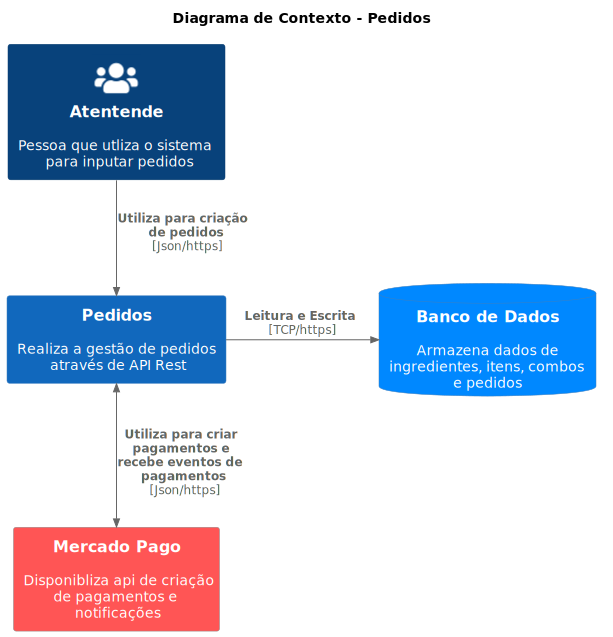
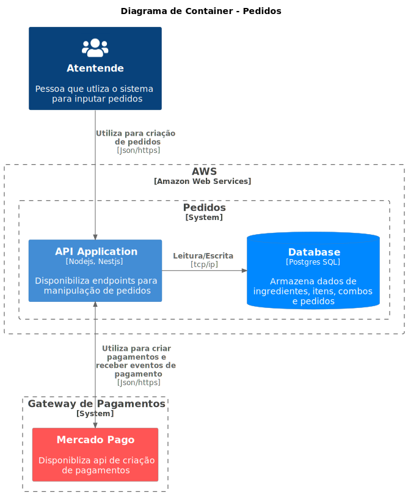

# Tech Challenge FIAP - Grupo 52

## Execução em um cluster k8s

Para executar a aplicação em um cluster Kubernetes, com o `kubectl` corretamente configurado, execute:

```shell
kubectl apply -f k8s
```

Com isso, a API estará disponível na porta 30001 do Cluster. Se for em um ambiente local com Docker Desktop ou _minikube_,
você pode acessar o endereço http://localhost:30001. Em ambientes de nuvem, substitua `localhost` pelo endereço público do cluster.

## Execução para desenvolvimento

Para executar o projeto em modo de desenvolvimento, copie o arquivo ***.env.example*** para ***.env*** e execute os seguintes comandos:

```shell
yarn install
```
```shell
yarn start:dev
```

Com isso, a API estará disponível na porta 3000 e pode ser acessada pelo endereço http://localhost:3000

## Execução em ambiente Docker

Para executar a aplicação usando Docker, basta executar o seguinte comando:

```shell
docker compose up -d
```

Com isso, a API estará disponível na porta 3333 e pode ser acessada pelo endereço http://localhost:3333

## Documentação

A documentação da aplicação é feita usando Swagger e pode ser acessada no endereço `/swagger` da API.
Para uso em ferramentas fora do navegador, como Postman ou Insomnia, o endereço `/swagger-json` pode ser utilizado.

Sendo assim, se a aplicação estiver de pé localmente em um cluster kubernetes, via _minikube_ ou Docker Desktop, por exemplo, você pode acessar http://localhost:30001/swagger e http://localhost:30001/swagger-json .

Já se estiver utilizando Docker, pode acessar em http://localhost:3333/swagger e http://localhost:3333/swagger-json .

E se estiver utilizando o ambiente de desenvolvimento via `yarn`, basta acessar em http://localhost:3000/swagger e http://localhost:3000/swagger-json .


## C4 Model
Adotamos o C4 Model para a documentação arquitetural do projeto. A seguir, os diagramas foram gerados utilizando o PlantUML.

### Context Diagram
Nesse diagrama, podemos ver o contexto da aplicação, com os atores externos e os sistemas externos com os quais a aplicação se comunica. É uma visão de alto nível, que mostra o que a aplicação faz, mas não como ela faz.




### Container Diagram
Nesse diagrama, podemos ver os componentes da aplicação e como eles se relacionam. Nesse nível de detalhe, podemos ver como a aplicação é composta e como ela se comunica com os sistemas externos.



### Deployment Diagram
Nesse diagrama, podemos ver como será a infraestrutura de execução da aplicação


